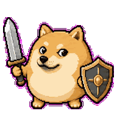

# DogeKnight Codex Pet

[English](#english) | [繁體中文](#繁體中文)



## English

This package contains a custom Codex pet:

- `pet.json`
- `spritesheet.webp`

### Install

1. Create a local pet folder named `dogeknight` under your Codex home.
   macOS/Linux: `~/.codex/pets/dogeknight`
2. Copy `pet.json` and `spritesheet.webp` into that folder.
3. Restart Codex, or run `Cmd+K` -> `Force Reload Skills`.
4. Open `Settings > Appearance > Pets` and select `DogeKnight`.

### Package Layout

```text
dogeknight/
├── pet.json
└── spritesheet.webp
```

### Notes

- `id` is `dogeknight`
- `displayName` is `DogeKnight`
- This package targets the local Codex custom pet format

## 繁體中文

這個套件包含一隻可安裝的 Codex 自訂寵物：

- `pet.json`
- `spritesheet.webp`

### 安裝方式

1. 在你的 Codex home 底下建立 `dogeknight` 資料夾。
   macOS/Linux：`~/.codex/pets/dogeknight`
2. 把 `pet.json` 和 `spritesheet.webp` 複製進去。
3. 重開 Codex，或執行 `Cmd+K` -> `Force Reload Skills`。
4. 到 `Settings > Appearance > Pets` 選擇 `DogeKnight`。

### 套件結構

```text
dogeknight/
├── pet.json
└── spritesheet.webp
```

### 備註

- `id` 是 `dogeknight`
- `displayName` 是 `DogeKnight`
- 這個套件適用於本機版 Codex 的自訂 pet 格式
